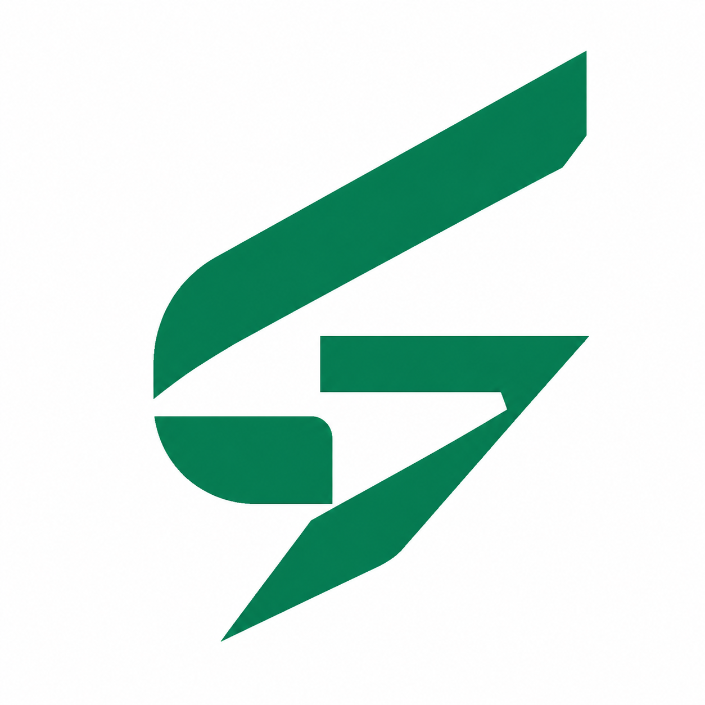
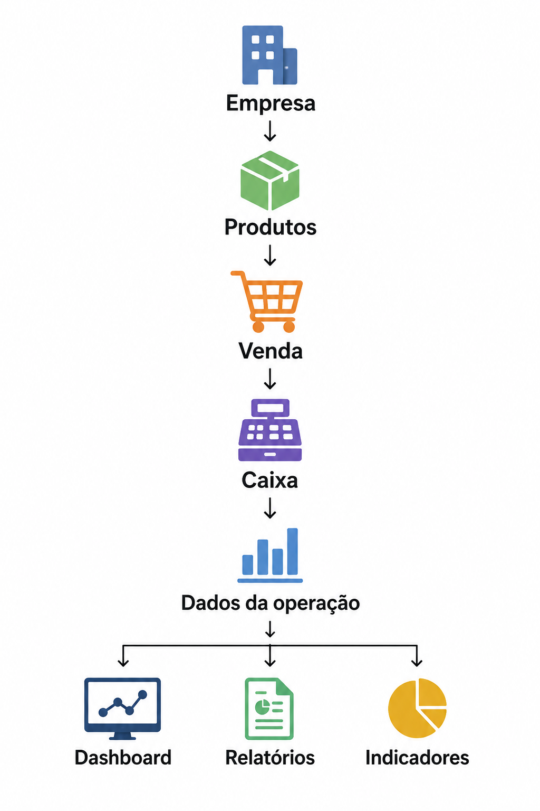
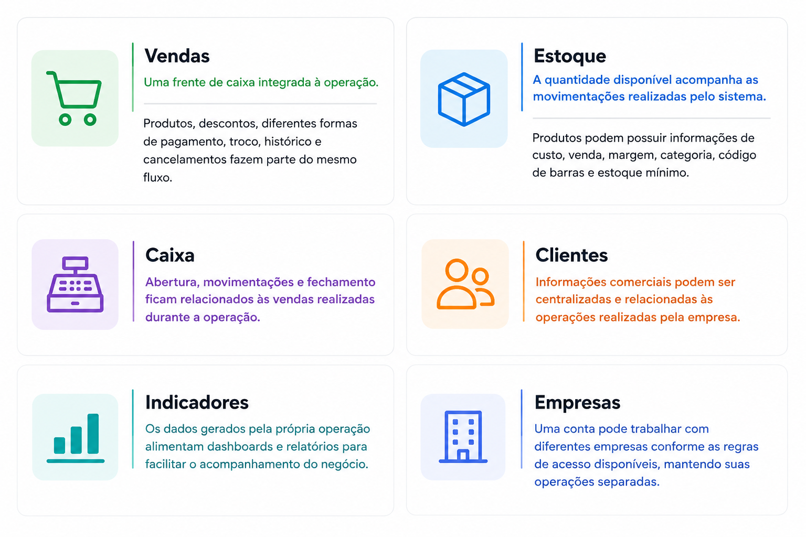
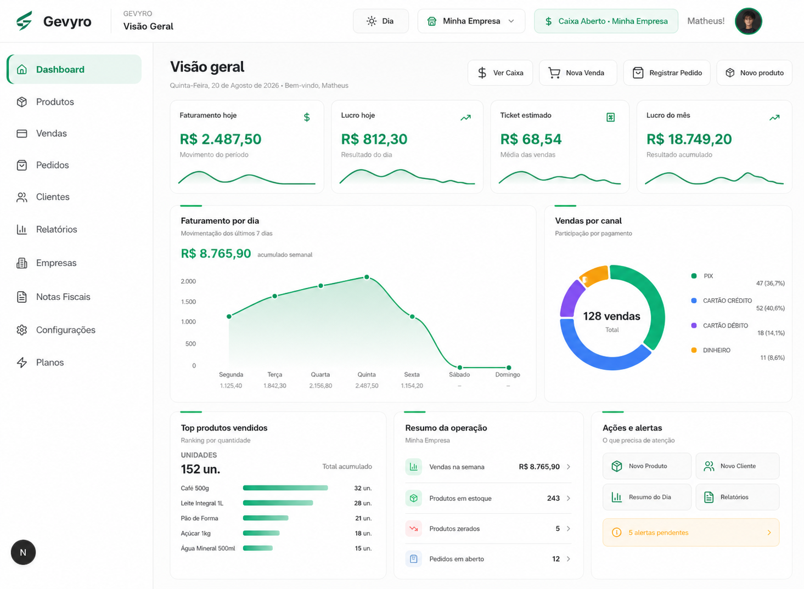
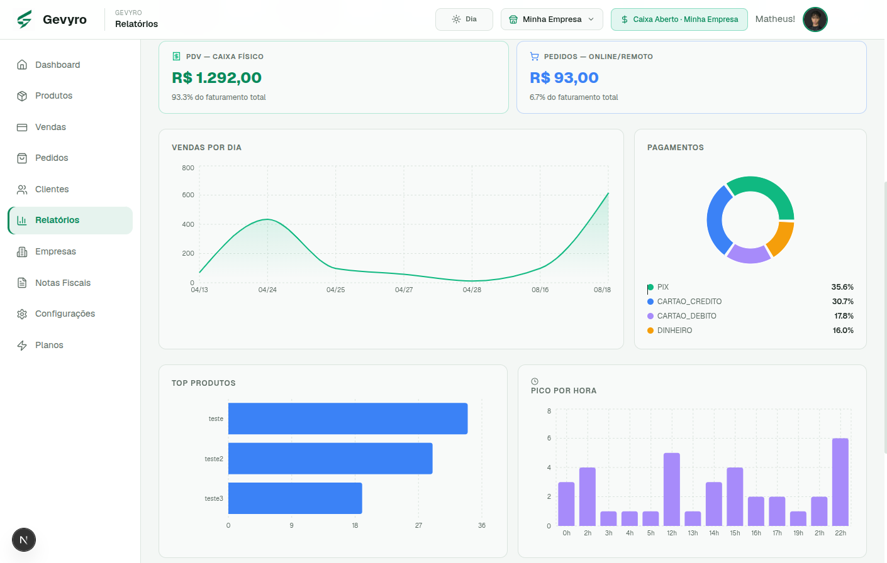
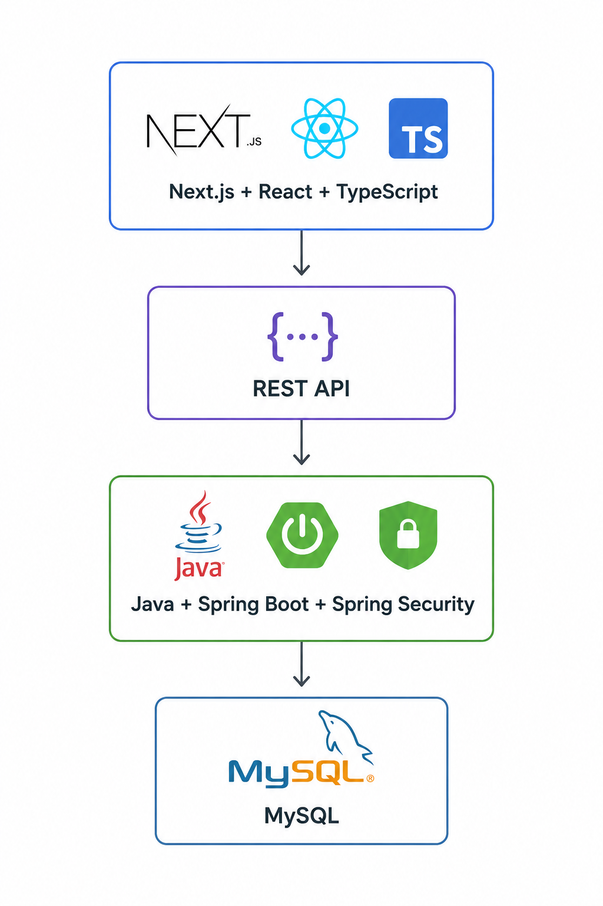

# Gevyro

### Gestão em evolução.

**Vendas, estoque, caixa, clientes e resultados conectados para você entender a operação sem depender de controles espalhados.**

 

[**Conheça a Gevyro**](https://www.gevyro.com.br) · [Recursos](#o-que-acontece-na-operação-se-conecta) · [Produto](#veja-a-gevyro-em-ação) · [Tecnologia](#por-trás-da-gevyro)

 

**30 dias grátis · Sem cartão de crédito**

 

## Crescer fica mais difícil quando cada informação está em um lugar

Uma pequena empresa costuma começar de forma simples.

Uma venda é registrada em um lugar. O estoque é conferido em outro. O caixa depende de contas manuais. Informações de clientes ficam separadas. No fim do dia existem números, mas nem sempre existe uma visão clara do que realmente aconteceu.

Enquanto a operação cresce, esse problema cresce junto.

A Gevyro foi criada para centralizar essa rotina em um único ambiente, conectando vendas, produtos, estoque, caixa, clientes, empresas e indicadores para transformar registros do dia a dia em informação útil para a gestão.

O objetivo não é adicionar mais uma ferramenta à empresa.

É reduzir a quantidade de lugares que precisam ser consultados para entender a operação.

 

### Menos informação espalhada. Mais clareza para administrar.

 

## O que acontece na operação se conecta

Uma venda não é apenas um registro isolado.

Quando uma operação é registrada, ela pode movimentar o estoque, ficar associada ao caixa, guardar a forma de pagamento, relacionar o cliente atendido e alimentar os indicadores usados para acompanhar o negócio.

É essa conexão que torna a gestão mais simples.

 

 

O produto entra no sistema.

A venda acontece.

O estoque acompanha a movimentação.

O caixa registra a operação.

Os dados passam a fazer parte dos relatórios.

No fim, cada ação ajuda a construir uma visão mais completa da empresa.

 

## Problemas reais da rotina, resolvidos no mesmo ambiente

<table>
<tr>
<td width="50%" valign="top">

### Vendas

No momento da venda, a equipe precisa de velocidade e organização.

A Gevyro concentra produtos, valores, pagamentos e movimentações em um fluxo pensado para a operação diária, reduzindo a dependência de anotações e controles paralelos.

</td>
<td width="50%" valign="top">

### Estoque

Descobrir que um produto acabou somente quando alguém tenta vendê lo gera retrabalho e perda de tempo.

Produtos e movimentações ficam ligados à operação para facilitar o acompanhamento do estoque e dar mais visibilidade sobre o que está disponível.

</td>
</tr>

<tr>
<td width="50%" valign="top">

### Caixa

Sem uma visão clara das entradas e movimentações, fechar o dia pode virar uma conferência manual.

As vendas ficam associadas ao caixa da operação, ajudando a manter o fluxo diário mais organizado e rastreável.

</td>
<td width="50%" valign="top">

### Relatórios

Ter dados não significa entender a empresa.

A Gevyro organiza as informações geradas durante a operação para facilitar a leitura de vendas, receita, lucro, ticket, produtos e formas de pagamento.

</td>
</tr>

<tr>
<td width="50%" valign="top">

### Clientes

Informações importantes sobre clientes não deveriam ficar espalhadas em diferentes lugares.

O cadastro e o relacionamento com clientes fazem parte da mesma operação, deixando os dados mais fáceis de consultar quando são necessários.

</td>
<td width="50%" valign="top">

### Empresas

Quando existe mais de uma operação, misturar dados cria confusão.

A estrutura multiempresa permite organizar diferentes empresas dentro da plataforma, mantendo a gestão separada de acordo com a operação selecionada.

</td>
</tr>
</table>

 

 

## Veja a Gevyro em ação

A plataforma foi construída para transformar a rotina empresarial em uma experiência mais clara, visual e conectada.

<table>
<tr>
<td align="center" width="50%" valign="top">

 

<b>Uma visão da operação para acompanhar os principais indicadores em um só lugar.</b>

</td>
<td align="center" width="50%" valign="top">

 

<b>Dados organizados para transformar movimentações do dia a dia em informação útil.</b>

</td>
</tr>
</table>

 

## Uma venda não termina quando o pagamento é confirmado

Quando diferentes partes da empresa trabalham separadas, o gestor precisa reconstruir o que aconteceu consultando telas, anotações ou planilhas diferentes.

A proposta da Gevyro é fazer o caminho contrário.

A venda pertence a um caixa. Os itens vendidos fazem parte do estoque. O pagamento compõe os dados financeiros da operação. O cliente pode estar relacionado à compra. O resultado passa a alimentar os indicadores.

Assim, uma ação operacional deixa de gerar apenas um registro e passa a contribuir para a visão do negócio.

 

## Feita para a rotina de quem está trabalhando

Um sistema de gestão não pode existir apenas para armazenar informações.

Ele precisa funcionar enquanto a empresa está vendendo, cadastrando produtos, acompanhando estoque, movimentando o caixa e consultando dados.

Por isso, a experiência da Gevyro busca reduzir etapas desnecessárias e manter as informações importantes acessíveis durante a operação.

O objetivo é permitir que a equipe trabalhe e que a gestão continue organizada ao mesmo tempo.

 

## O dashboard existe para responder perguntas

Quanto a empresa vendeu.

Qual foi o lucro registrado.

Qual é o ticket da operação.

Quais produtos estão performando melhor.

Como os clientes estão pagando.

Como as vendas estão evoluindo ao longo do tempo.

Essas informações ganham valor quando deixam de ser números isolados e passam a contar a história da operação.

O dashboard foi pensado para concentrar essa leitura e ajudar quem administra a empresa a enxergar o que está acontecendo sem precisar montar o cenário manualmente.

 

## Gestão em evolução

Empresas mudam todos os dias.

Novos produtos entram. Vendas acontecem. Clientes chegam. Processos amadurecem. A operação cresce.

A tecnologia usada para administrar tudo isso também precisa acompanhar essa mudança.

É essa ideia que orienta a Gevyro.

 

## Menos controles espalhados. Mais clareza sobre a operação.

Conheça a plataforma e veja como a Gevyro pode organizar a rotina do seu negócio.

 

### [Acessar gevyro.com.br](https://www.gevyro.com.br)

**Teste grátis por 30 dias · Sem cartão de crédito**

 

## Por trás da Gevyro

A experiência começa pelo produto, mas existe uma arquitetura de software sustentando cada operação.

A Gevyro combina uma aplicação web moderna com uma API responsável pelas regras de negócio, autenticação, autorização, persistência e integração entre os módulos.

 

### Tecnologia

 

**Backend**

Java 17, Spring Boot, Spring Security, Spring Data JPA, Hibernate, JWT, OAuth2, Jakarta Validation e Maven.

**Frontend**

Next.js 14, React, TypeScript, Tailwind CSS e shadcn/ui.

**Banco de dados**

MySQL para persistência principal e H2 no ambiente de testes.

 

 

### Arquitetura

A aplicação separa responsabilidades entre interface, API, segurança, serviços de negócio, persistência e banco de dados.

O frontend concentra a experiência do usuário.

A API processa as regras da operação.

A camada de segurança controla autenticação e autorização.

Os serviços organizam o comportamento do domínio.

A persistência mantém os dados relacionais da aplicação.

A documentação técnica mais detalhada do backend fica disponível em:

[`Backend/README.md`](Backend/README.md)

 

### Segurança

A Gevyro utiliza Spring Security para proteção dos recursos da aplicação, BCrypt para armazenamento seguro de senhas e autenticação baseada em JWT.

O projeto também possui suporte a OAuth2 e utiliza cookies HttpOnly para reduzir a exposição do token ao JavaScript executado no navegador.

Nos ambientes em que a configuração de produção está ativa, cookies sensíveis utilizam atributos de segurança apropriados, como `Secure`.

O acesso aos dados considera o usuário autenticado e a empresa associada ao recurso solicitado, além das validações aplicadas às entradas recebidas pela API.

Credenciais, chaves e segredos de ambiente não devem fazer parte do código fonte versionado.

 

## Desenvolvimento contínuo

A Gevyro continua evoluindo junto com o produto.

Novos recursos, melhorias de experiência, ajustes de regras de negócio, testes e mudanças de arquitetura fazem parte do desenvolvimento contínuo da plataforma.

Este repositório representa a implementação técnica do produto e acompanha essa evolução.

 

## Informações institucionais

**Marca:** Gevyro

**Segmento:** Software de gestão empresarial

**CNPJ:** 68.259.534/0001-70

**Website:** [www.gevyro.com.br](https://www.gevyro.com.br)

 

## Desenvolvimento e autoria

Desenvolvido por **Matheus Martins · MartnsDev**

[GitHub](https://github.com/MartnsDev) · [LinkedIn](https://www.linkedin.com/in/matheusmartnsdev/)

 

## Direitos

Copyright © 2026 Matheus Martins.

Todos os direitos reservados.

O código fonte e os demais componentes deste repositório permanecem sujeitos aos termos definidos pelo titular dos direitos.

Consulte o arquivo [`LICENSE`](LICENSE) para as condições aplicáveis ao uso do código.

 

### GEVYRO

**Gestão em evolução.**

[www.gevyro.com.br](https://www.gevyro.com.br)

